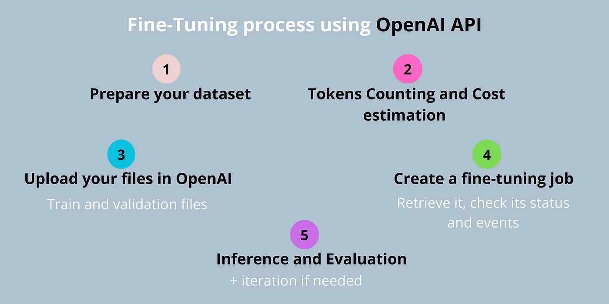
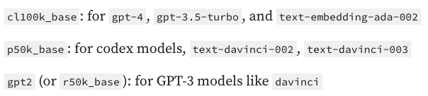

# Openai - Fine-Tuning
#### Last Update - 01/03/2024
## Links
(a) [Tutorial](https://medium.com/ai-advances/complete-process-for-fine-tuning-gpt-3-5-turbo-using-openai-api-db4a50b3de1a)

## Summary
airline sentiment tweets analysis

Create classification data for openai fine tuning 

## Knowledge
(a) 


(b) tiktoken - Encoding for okenization
https://towardsdatascience.com/easily-estimate-your-openai-api-costs-with-tiktoken-c17caf6d015e



```
ex:
encoding = tiktoken.get_encoding("cl100k_base")
encoding = tiktoken.encoding_for_model("gpt-3.5-turbo")
text = "Alice has a parrot.\n
What animal is Alice's pet?\n
Alice's pet is a parrot."

tokens = encoding.encode(text)
-> [44484, 468, 257, 1582, 10599, 13, 198, 2061, 5044, 318, 14862, 338, 4273, 30, 198, 44484, 338, 4273, 318, 257, 1582, 10599, 13]
-> #tokens = len(tokens)
```


## Steps
#### (1) Load openai API_KEY
Create .env file, with API_KEY = "YOUR_API_KEY", load API_KEY with load_dotenv package 

#### (2) Create classification data for LLM
user content: the tweet
assistant content: the sentiment which we want to predict, 

you want to assistant(openai) to predict the sentiment

```
ex:
{
  "messages": [
    {
      "role": "system",
      "content": "You are a helpful assistant. You are to extract the sentiment analysis from the provided airline tweets."
    },
    {
      "role": "user",
      "content": "Airline: Virgin America\n\nTweet: @VirginAmerica What @dhepburn said.\n\nAirline Sentiment: "
    },
    {
      "role": "assistant",
      "content": "neutral"
    }
  ]
}
```

#### (3) Create training jsonl file to send to openai
#### (4) openai helps create a fine tune model for your dataset,  with more epochs  increase performace